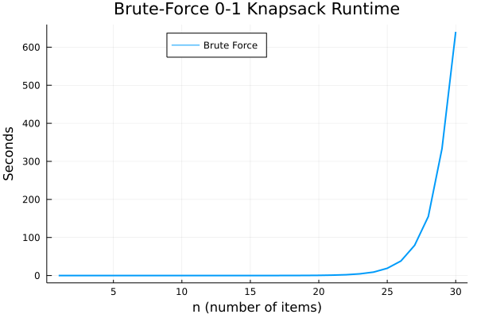
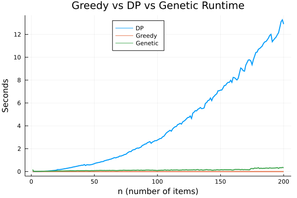
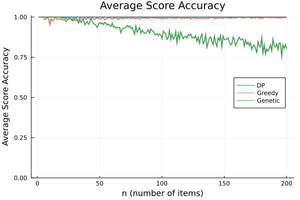
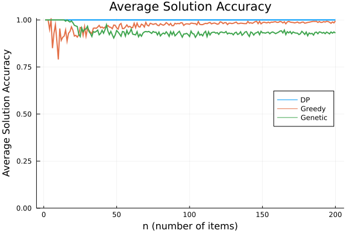
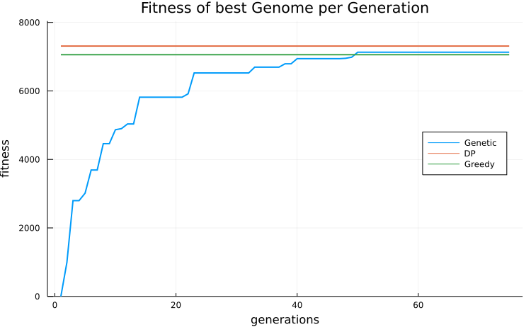
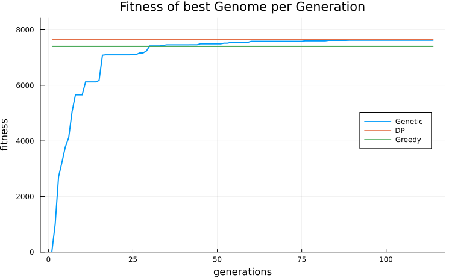
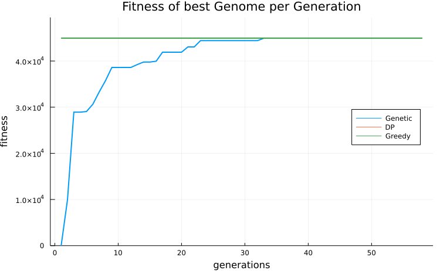
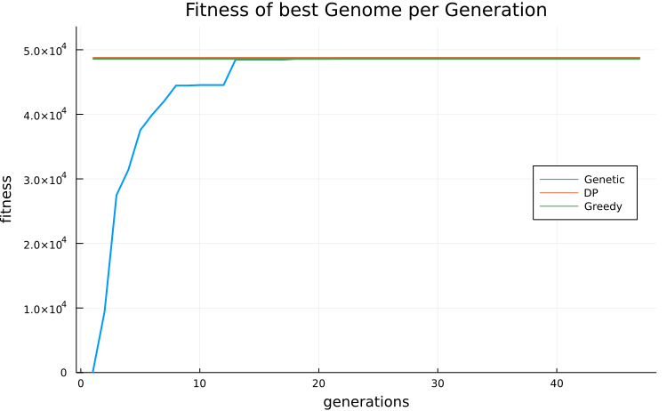

# Genetic Algorithms for the Discrete (0-1) Knapsack Problem

The goal of this repository is to explore and implement in [Julia](https://julialang.org/) a [Genetic Algorithm](https://en.wikipedia.org/wiki/Genetic_algorithm), a subclass of [Evolutionary Algorithms](https://en.wikipedia.org/wiki/Evolutionary_algorithm), that will be used to find a good solution for the [Discrete (0-1) Knapsack problem](https://en.wikipedia.org/wiki/Knapsack_problem#0-1_knapsack_problem). Other approaches ([Brute Force](https://en.wikipedia.org/wiki/Proof_by_exhaustion), [Greedy](https://en.wikipedia.org/wiki/Greedy_algorithm), [Dynamic Programming](https://en.wikipedia.org/wiki/Dynamic_programming)) habe also been implemented in order to set a benchmark for the results of the Genetic algorithm.
   

## A little bit about the Problem

The "0-1 Knapsack" problem is an [Integer Programming](https://en.wikipedia.org/wiki/Integer_programming) optimization problem, restricted to the domain {0, 1}. Formally, given n items, their corresponding "weights" **w**, "values" **v** and a "knapsack capacity" W, the goal is to find a binary vector **x** that solves:

maximize **x**T**v**

subject to **x**T**w** <= W

That is, to choose the items which the sum of their weights does not exceed the knapsack capacity W and simulteanously maximize the total value.
   

## Genetic algorithm

The main idea behind Genetic Algorithms is to simulate the process of Natural Selection. An initial population consisting of candidate solutions is created, and then through

- Selection of the fittest
- Crossovers
- Mutations

the population gets updated so that every new generation inherits features from the fit candidates,
those with the highest fitness (score). In the 0-1 Knapsack problem, the fitness of a solution is 0 if the solution is invalid (exceeds knapsack capacity), else the sum of the values selected by it.

The very nature of the Knapsack problem allows us to frame a genome (candidate solution) as a binary vector, which comes in as very handy for the processes mentioned above.

There are many approaches to genetic algorithms, some of them discussed here
- [Improvements in Genetic Algorithms](https://www.researchgate.net/publication/3102588_Improvements_in_Genetic_Algorithms)
- [Genetic algorithms with multi-parent recombination](https://www.researchgate.net/publication/220701605_Genetic_algorithms_with_multi-parent_recombination)

The key concept, which has also been [implemented](src/algorithms/genetic.jl) in this repo, is the idea of [Elitism](https://en.wikipedia.org/wiki/Genetic_algorithm#Elitism). Elitism suggets that a fraction of the fittest genomes should survive "as is" in the next generation. This allows for more valid candidate solutions to be propagated in the population, thus reducing the amount of the invalid ones. We will see later the differences in results.
   

### Hyperparameters of the Genetic Algorithm

- *Population Size*: The number of genomes that make up the whole population.
- *Initialize with zeros*: True if the bits of all the genomes should be initialized to 0. Else they get initialized randomly (unstable for high weights).
- *Max Generations*: The number of iterations to perform (can be shortened by using Early Stopping).
- *Threshold*: Used for early stopping; Denotes the minimum value which the best fitness should increase to be considered as progress.
- *Patience*: Used for early stopping. The number of generations (iterations) to wait for progress. If achieved, then the algorithm stops.
- *Elitism Amount*: The number of genomes that pass to the next generation, remaining untouched.
- *Number of Mutations*: The number of genome mutations to perform in mutation step.
- *Mutation Probability*: The probability that a bit of a genome gets mutated during the mutation step, if selected.
   

## Other approaches

- [Brute force](src/algorithms/brute_force.jl)
    
    Enumerate all the possible solutions. There are n items totally, where each can either be selected or not. Thus, there are 2 possibilities for every item, giving an exponential
    complexity: O(2n).

- [Greedy](src/algorithms/greedy.jl)

    Sort all items by the key: weight/value in a descending order. Then start picking the items
    in an ascending order, until there is no more space in the knapsack or the items have finished.
    The complexity of this algorithm is: O(nlon) (because of the sorting). Note that this algorithm
    will give always the best solution for continuous (fractional) Knapsack problem. In the discrete, it will only give an approximation.

- [Dynamic Programming](src/algorithms/dynamic_programming.jl)

    The 0-1 Knapsack problem has 2 properties that allow it to be solved using DP methods:

    - Optimal substructure
    - Independent sub-problems

    Using an optimal solution for the problem with (n-1) items and all the weights up to W, we can quickly dedude the optimal solution for the problem with n items using the formula:

    OPT(n, W) = max(OPT(n-1, W - weight[n]) + value[n], OPT(n-1, W))

    The complexity of this algorithm is O(nW).
   

## Experiments

Firstly, let's get a taste of how slow the Brute-Force search is:

  

Yeap, no need to explain.

Let's now see the runtime of the Greedy, DP and Genetic-Algorithm methods, for W = 10000:

  

As the number of items increase, DP gets progressiively slower. The greedy method is the fastest by far, while the genetic-algorithm slowly decreases it's performance over time.
   

Regarding the accuracies of the solutions found:

  

The greedy algorithm does a good job at finding almost-optimal solutions. The genetic algorithm struggles as the number of items increases. This is to be expected, as
the population size was constant throughout all these experiments (1000). Increasing it would decrease speed, but increase accuracy over larger inputs.
   

Let's now see how close the solutions found were to the actual optimal solutions:

  

Both the greedy and the genetic-algorithm seem to converge to sub-optimal solutions. They get stuck in local optima, which are hard to get away from.
   

But is it normal for the Genetic algorithm to be underperforming compared to the Greedy?
Well, it depends on the very nature of the problem. For example. supposing we have we
have a knapsack with capacity W = 100 and n = 2 items with:

Properties | Item 1 | Item 2 |
---------- | ------ |:------ |
weights    | 2      | 99     |
values     | 3      | 99     |

that is, the optimization problem:

maximize 3x1 + 99x2

subjecto to 2x1 + 99x2 <= 100

The greedy algorithm will pick just item 1, having a total value of 3, which if far from the optimal value of 99, attaining by just picking Item 2. We can see that these bottleneck occur when the weights of the items are very close to the capacity of the knapsack W.
Rerunning some experiments with higher item weights and for different values of the hyperparameters of the Genetic Algorithm, yields the following results:

- W = 1000, n_items = 1000, population = 1000

  

- W = 1000, n_items = 1000, population = 10000

  

- W = 10000, n_items = 100, population = 1000

  

- W = 10000, n_items = 100, population = 10000

  

   

It is clear to see that in these examples the Genetic algorithm surpasses the greedy algorithm in few iterations, by achieving at least as good results as the greedy, and sometimes better. These results are expected.